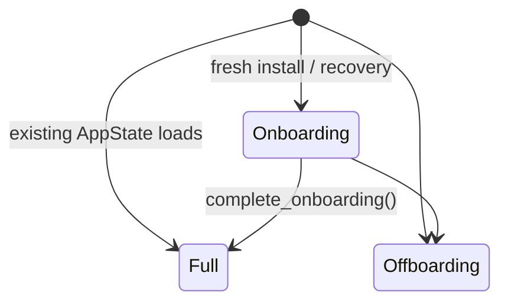
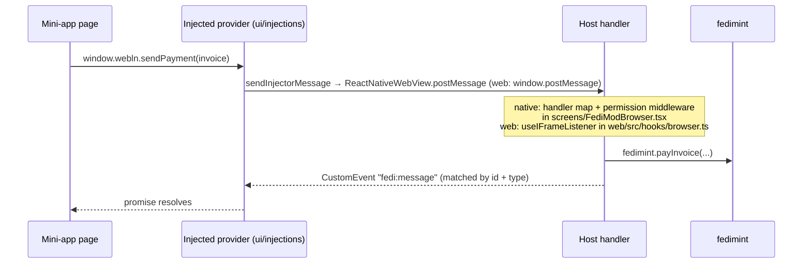

# Hacking on Fedi

This is the contributor guide. For a tour of what lives where, read the [README](./README.md)
first.

<!-- toc -->

- [Setting up](#setting-up)
- [Architecture](#architecture)
- [Building](#building)
- [Testing](#testing)
- [Linting and formatting](#linting-and-formatting)
- [Rust conventions](#rust-conventions)
- [UI conventions](#ui-conventions)
- [Submitting changes](#submitting-changes)
- [Continuous integration](#continuous-integration)
- [Releases and app flavors](#releases-and-app-flavors)

<!-- tocstop -->

## Setting up

### Nix is not optional

The development environment is defined by `flake.nix` and built on
[flakebox](https://github.com/rustshop/flakebox). It pins everything: the Rust toolchain and its
Android/iOS/WASM targets, Node and Yarn, the JDK, the Android SDK, `bitcoind`, `lnd`, Core
Lightning, `electrs`, a Matrix homeserver, a nostr relay, `mprocs`, and more.

Practically every script in `scripts/` calls `scripts/enforce-nix.sh`, which re-executes the script
inside `nix develop` if `IN_NIX_SHELL` is unset. You can technically install Node and Yarn yourself
and work on `ui/` alone, but nothing else is supported that way.

1. [Install Nix](https://nixos.org/download.html) with flakes enabled. The
   [Fedimint dev-env docs][dev-env] walk through this.
2. Accept the binary cache when prompted. `flake.nix` declares `fedibtc.cachix.org` as a
   substituter; without it you will build the whole toolchain from source.
3. Enter the shell: `nix develop`, in every terminal you work from. Or install
   [direnv](https://direnv.net) and run `direnv allow` once — `.envrc` is just `use flake`.

Entering the default shell runs `.config/flakebox/shellHook.sh`, which symlinks the git hooks from
`misc/git-hooks/` into your `.git/hooks/` and sets the commit message template. This is the only
thing that installs the hooks, so do not skip it.

### The dev shells

| Shell | Use for |
| --- | --- |
| `nix develop` | Everything, by default |
| `nix develop .#xcode` | Anything touching Xcode: iOS bridge, CocoaPods, TestFlight |
| `nix develop .#lint` | The lint tools alone (`semgrep`, `treefmt`); what CI's lint job uses |
| `nix develop .#vercel` | Deploying the PWA |

The `xcode` shell is impure: it symlinks your host's `/Applications/Xcode.app`. Run
`just install-xcode` if you need one.

### First build

```bash
just build-ui-deps    # yarn install, via scripts/ui/build-deps.sh
just run-dev-ui       # build the bridge, then run native + PWA under mprocs
```

`just` on its own lists every recipe. Note that inside the dev shell `CARGO_BUILD_TARGET_DIR` is set
to `target-nix/`, separate from a plain `cargo build`'s `target/`.

### Two dev loops

There are two `mprocs` setups and they do different things:

- **`just run-dev-ui`** (`misc/mprocs-dev-ui.yaml`) — the app. Panes for Metro, the Next.js dev
  server, Android, iOS, a watcher for `@fedi/common`, a remote bridge with a dev federation, and
  Appium. Press `t` in the `dev` pane for a test menu. Use `just run-dev-ui interactive` to be
  prompted for each build step, or `device` to build for a physical iOS device. Individual steps can
  be skipped with env vars, e.g. `BUILD_BRIDGE=0 just run-dev-ui`.
- **`just mprocs`** (`misc/mprocs.yaml`) — a local dev federation only, for bridge and protocol
  work. It runs `devi dev-fed` (four guardians, two Lightning gateways, `bitcoind`) and tails their
  logs. No app.

## Architecture

Read the README's diagram first. This section goes one level deeper: how dispatch, events and the
UI wiring actually work, and [where to start when something misbehaves](#where-to-look-when-debugging).

### One core, two adapters

`crates/bridge` holds the real logic. `bridge/fedi-ffi` (uniffi, for Android and iOS) and
`bridge/fedi-wasm` (wasm-bindgen, for the browser) are thin platform shims that supply a platform
`EventSink` and an `IStorage`, then forward calls inward. `fedi-wasm` even reuses `fedi-ffi`'s RPC
glue, so a fix in the shared RPC layer fixes both platforms at once. **If you are adding a feature,
it belongs in `crates/`, not in `bridge/`.**

Layering below the bridge: `runtime` is the foundation (storage, database, events, feature flags,
Fedi's API client) and carries no business logic. `bridge` is the router on top. `federations`,
`matrix`, `communities`, `multispend` and friends are the subsystems `bridge` dispatches into.
Fedimint client modules (mint, lightning, wallet, `fedi-social`, both stability pools) are
registered in `crates/federations/src/federation_v2/mod.rs`.

### The RPC boundary

Three functions plus a callback, from `bridge/fedi-ffi/src/fedi.udl`:

```
[Async] string fedimint_initialize(EventSink event_sink, string init_opts_json);
[Async] string fedimint_rpc(string method, string payload);
        sequence<string> fedimint_get_supported_events();
```

TypeScript sends a method name and a JSON payload and gets JSON back. Asynchronous notifications
travel the other way through `EventSink.event(event_type, body)`. Use
`fedimint_get_supported_events` to enumerate the event types the bridge can emit rather than
hardcoding that list UI-side.

How a call dispatches, hop by hop:

1. A component or thunk calls a typed wrapper on `FedimintBridge`
   (`ui/common/utils/fedimint.ts`). The class is constructed with an injected transport function —
   that is the entire platform abstraction. Native injects `NativeModules.FedimintFfi.rpc`
   (`ui/native/bridge/native.ts`, backed by Kotlin `FedimintFfiModule.kt` and Swift
   `FedimintFfi.swift`); web injects a token-correlated `postMessage` round trip to the WASM worker
   (`ui/web/src/lib/bridge/worker.ts` ↔ `wasm.worker.ts`, persisting to an OPFS-backed redb file
   `bridge.db`).
2. Both platforms land in `fedimint_rpc_async` → `RpcMethods::handle` in
   `bridge/fedi-ffi/src/rpc.rs`. The `rpc_methods!` registry near the bottom of that file is the
   single source of truth for every method name; "Unrecognized RPC command" means the method is
   missing there (or your `bindings.ts` is stale).
3. Handlers are declared with macros: `rpc_method!` (plain), `federation_rpc_method!`
   (auto-resolves the `federationId` argument to a `FederationV2`), or
   `federation_recovering_rpc_method!` (also works while that federation is mid-recovery). A method
   that errors during recovery is probably using the wrong macro.
4. Arguments deserialize into a macro-generated struct; the subsystem is fetched off the bridge via
   the `TryGet` trait — this is where "complete onboarding first" errors are raised. Results come
   back as `{"result": ...}`, failures as `RpcError` JSON, which the UI surfaces as a thrown
   `BridgeError`.

### The bridge is a state machine

Many RPCs fail until the bridge reaches `Full`; the `bridgeStatus` RPC tells you which state you
are in.



Onboarding stages are `Init` → `SocialRecovery` / `DeviceIndexSelection`
(`crates/bridge/src/onboarding.rs`); offboarding reasons are `DeviceIdentifierMismatch`,
`InternalBridgeExport` and `DeviceIndexConflict` (`crates/bridge/src/full.rs`).

`BridgeFull` (`full.rs`) owns the subsystems — `Runtime`, `Federations`, `Communities`, `BgMatrix`,
multispend, sp-transfer, device registration, `Nostril` — and its `start_bg` spawns the multispend
and sp-transfer coordination services as background tasks, so bugs in those features often live in
a task, not in an RPC handler. Matrix is wrapped in `BgMatrix` (`crates/bridge/src/bg_matrix.rs`)
and initializes lazily in the background; "matrix not ready yet" races start there.

### Events and streams

Two mechanisms share the `EventSink` callback:

- **Fire-and-forget events.** A subsystem calls `runtime.event_sink.typed_event(&Event::...)`. The
  `Event` enum and its camelCase type strings (`"balance"`, `"transaction"`, ...) live in
  `crates/rpc-types/src/event.rs` — not in `runtime`. The supported-events list is duplicated by
  hand in `bridge/fedi-ffi/src/ffi.rs` (a test enforces enum ⊆ list), so adding a variant means
  touching both.
- **Streams (subscriptions).** `RpcStreamPool` (`crates/runtime/src/rpc_stream.rs`) pushes each
  item of a Rust `Stream` as a `"streamUpdate"` event carrying `{stream_id, sequence, data}`. On
  the TS side `FedimintBridge.rpcStream` allocates the id and keeps a handler map; unsubscribing
  fires the `streamCancel` RPC. A stalled subscription is debugged at exactly those two files.

Delivery differs per platform before converging:

| Hop | Native | Web |
| --- | --- | --- |
| Rust → JS | uniffi callback → `EventDispatcher` (Kotlin/Swift) → `BridgeNativeEventEmitter`; the JS side must register via `subscribeToBridgeEvents()` (`ui/native/bridge/native.ts`) | worker calls `postMessage({event, data})`, demuxed in `worker.onmessage` — there is **no separate subscribe step on web** |
| JS fan-out | `fedimint.emit(type, body)`: `streamUpdate` routed by `stream_id`, everything else to `addListener` subscribers | same |
| → Redux | listeners registered in one place: `initializeCommonStore` (`ui/common/redux/index.ts`) | same |

Two details worth knowing in that last hop: `balance` events are debounced before dispatching, and
some thunks register their own temporary listeners (e.g. `receiveEcash` listens for
`transaction`).

### Types are generated, never hand-written

Rust types in `crates/rpc-types` derive `ts-rs`'s `TS`. `just generate-bridge-bindings` runs
`scripts/bridge/ts-bindgen.sh`, which exports each type, concatenates them onto the hand-written
prelude `ui/common/types/bindings.ts.inc`, and writes `ui/common/types/bindings.ts`. Never edit
`bindings.ts` by hand; change the Rust type and regenerate.

### Mini-apps: the webview message protocol

Mini-apps run in a WebView (native) or iframe (web) and get `window.webln` / `window.nostr` from
scripts in `ui/injections`:



A broken WebLN/nostr call is one of exactly four suspects: the injected script
(`ui/injections/src/injectables/`), the message matcher (`ui/injections/src/utils.ts`), the host
handler map, or the underlying bridge RPC.

### The remote bridge

`crates/remote-server` is an axum HTTP/WebSocket server that hosts real `Bridge` instances out of
process, keyed by device ID. It backs the UI integration tests (port `26722`) and lets you drive a
bridge without any app: `POST /:device_id/init`, `POST /:device_id/rpc/:method`, events over
WebSocket at `GET /:device_id/events` — plus `/invite_code` and `/generate_ecash/:amount` when run
with `--with-devfed`. `just clear-remote-bridge` wipes its state.

### Fedimint is a fork

`Cargo.toml` pins `github.com/fedibtc/fedimint` at tag `v0.11.0-fedi7`, and `matrix-rust-sdk`,
`uniffi` and `iroh` are likewise pinned to Fedi forks, so upstream documentation may not match the
behavior you observe.

### Where to look when debugging

| Symptom | Start here |
| --- | --- |
| RPC error / wrong data | The method's entry in the `rpc_methods!` registry → handler → subsystem |
| "Unrecognized RPC command" | Missing from that registry, or stale `bindings.ts` |
| "complete onboarding first" | The bridge state machine — check `bridgeStatus` |
| Event never reaches the UI | Walk the hop table above one hop at a time; remember the hand-maintained supported-events list in `ffi.rs` |
| Stream stalls | `RpcStreamPool` (Rust) ↔ `rpcStream` handler map (TS); check sequence numbers and early `streamCancel` |
| Redux wrong after an event | `initializeCommonStore` wiring; remember `balance` is debounced |
| Matrix race | `BgMatrix` lazy initialization |
| Multispend / sp-transfer oddity | The background services from `BridgeFull::start_bg`, not just the RPC handlers |
| Mini-app API failure | The four suspects listed under the webview protocol |
| Need a bridge without the app | The remote bridge routes above |

## Building

| Command | Builds |
| --- | --- |
| `just build` | The Rust workspace (`cargo build --all-targets`) |
| `just check` / `just check-wasm` | `cargo check`, natively or for `wasm32-unknown-unknown` |
| `just build-bridge` | The mobile bridge: Android and iOS libraries plus TypeScript bindings |
| `just build-bridge-android` | Android bridge artifacts only |
| `just build-bridge-ios` | iOS bridge artifacts only (uses the `xcode` shell) |
| `just build-wasm` | The WASM bridge (`build-wasm-release` for a release profile) |
| `just install-wasm` | Installs the built WASM into `@fedi/common` |
| `just generate-bridge-bindings` | Regenerates `ui/common/types/bindings.ts` |
| `just build-ui-deps` | `yarn install` for the UI workspace |
| `just pod-install` | CocoaPods for the iOS app |

Building the Android bridge outside Nix is unsupported; the dev shell provides the SDK, NDK,
cross-compilation toolchains, and linker setup. See [bridge/README.md](./bridge/README.md) for the
current mobile bridge build details and troubleshooting notes.

## Testing

### Rust

The bridge tests spin up a real local federation with `devi` (devimint), backed by the `bitcoind`,
`lnd`, Core Lightning, Matrix and nostr binaries the dev shell provides. Nothing external is needed,
but they are slow.

| Command | Runs |
| --- | --- |
| `just test` | `cargo test` over the workspace |
| `just test-bridge [testcase]` | The bridge suite against a dev federation |
| `just test-stability-pool` | Stability Pool v1 module tests |
| `scripts/test-stability-pool-v2.sh` | Stability Pool v2 module tests |
| `scripts/test-fm-upstream-tests.sh` | Upstream Fedimint suites, e.g. `cli-tests` |
| `scripts/test-ci-all.sh` | Everything above, in parallel — what CI runs |

Tests run under `cargo nextest`. `.config/nextest.toml` kills any test that hangs for 60s, and
retries tests whose names begin with `flaky_` three times in the `ci` profile.

### UI

| Command | Runs |
| --- | --- |
| `just test-ui` | Unit and integration tests |
| `just run-ui-unit-tests [workspace]` | Jest unit tests |
| `just run-ui-integration-tests [workspace]` | Jest integration tests, against a remote bridge |
| `yarn test:web:e2e` (in `ui/`) | Playwright end-to-end tests for the PWA |
| `scripts/ui/run-android-e2e.sh`, `run-ios-e2e.sh` | Appium end-to-end tests for the app |

Integration tests drive a real remote bridge rather than a mock. End-to-end tests do not run on
pull requests — they run on a schedule. See [ui/docs/TESTING.md](./ui/docs/TESTING.md) for the
detail.

## Linting and formatting

```bash
just format        # treefmt over Rust and Nix sources
just lint          # runs the pre-commit hook without stashing
just clippy        # native and wasm32 clippy
just semgrep       # the custom rules in .config/semgrep.yaml
just typos         # spell check; add valid words to .typos.toml
just final-check   # lint + clippy + test. Run this before opening a PR.
just lint-ui       # eslint over ui/
just format-ui-code
```

`.treefmt.toml` is the source of truth for Rust and Nix formatting. The `pre-commit` hook temporarily
stashes unstaged tracked changes, then checks formatting, `Cargo.lock`, semgrep, shellcheck, and
whitespace. `just lint` sets `NO_STASH=true` and checks the current worktree directly.

## Rust conventions

Beyond what `rustfmt` and `clippy` enforce, this codebase has rules that exist because the same code
must compile to WASM, where much of `std` misbehaves. `.config/semgrep.yaml` enforces them:

| Don't | Do | Why |
| --- | --- | --- |
| `SystemTime::now`, `Instant::now` | `fedimint_core::time::now` | WASM compatibility |
| `tokio::spawn` | `fedimint_core::task::spawn` | Names the task |
| `tokio::time::sleep` | `fedimint_core::task::sleep` | Does not work in WASM |
| `fs::write`, `File::create` | `fedimint_core::util::write_overwrite` | Be explicit on overwrite |
| `use foo::*` | Name your imports | Except `use super::*` in test modules |

`.clippy.toml` additionally bans `tokio::sync::watch::Sender::send` — use `send_replace`.

`.rustfmt.toml` sets edition 2024, `StdExternalCrate` import grouping, `Module` import granularity,
and comment wrapping. Just run `just format`.

The clippy and build recipes deliberately avoid `--workspace` (see the overrides in `flake.nix`).

## UI conventions

`@fedi/common` holds the shared logic — Redux state, hooks, types, i18n — and renders nothing.
`@fedi/web` and `@fedi/native` are two renderers of it. Logic that both platforms need belongs in
`common`. To stay platform-neutral, `common` never imports the bridge instance: thunks take
`fedimint` as an argument (`dispatch(payInvoice({ fedimint, ... }))`) and each platform injects its
own transport. Follow that pattern when adding thunks.

Keep native and web at parity, or say why not: the pull request template asks for it explicitly.

Dependencies are hoisted into `ui/node_modules`, and shared versions are kept in step with
[syncpack](https://jamiemason.github.io/syncpack/):

```bash
cd ui
yarn run syncpack                  # report mismatches
yarn run syncpack fix-mismatches   # align to the highest version
```

Prefer `yarn` over `npm`. Yarn 1 is pinned in `ui/package.json`; Turborepo orchestrates the builds.
See [ui/README.md](./ui/README.md).

## Submitting changes

**Commit messages must be [Conventional Commits](https://www.conventionalcommits.org).** The
`commit-msg` hook runs `convco check` and will reject anything else. Recent history gives the shape:

```
feat(native): join community default chats from the chat tile
fix(web): ...
test(e2e): poll past the backup reminder overlay on android
chore: bump version for 26.6.1
```

Explain *why* in the body — the commit template says so. There is no gitmoji convention here.

Before pushing, run `just final-check` (and `just test-ui` if you touched `ui/`).

Fill in the pull request template: description with a `ref #`, screenshots for UI changes, how you
tested it, **impact on native/web parity**, and QA guidance. `CODEOWNERS` routes review
automatically — `bridge/` to `@fedibtc/bridge`, `ui/` to `@fedibtc/ui`, build files to
`@fedibtc/build-system`, and so on. Pull requests are squash-merged.

## Continuous integration

CI runs on self-hosted runners and builds through Nix, so a green `just final-check` locally is a
good predictor.

| Workflow | Trigger | Does |
| --- | --- | --- |
| `nix.yml` | Every PR; pushes to `master` | Lint, clippy, `testCiAll`, and all platform builds |
| `test-ui.yml` | Every PR | eslint, prettier, unit and integration tests |
| `e2e-tests.yml` | Cron, three times daily; manual | Android, iOS and web end-to-end suites |
| `vercel-preview.yml` | PRs | Deploys a PWA preview |
| `relay-commits.yml` | Hourly | Mirrors commits to the public repository |

Both `nix.yml` and `test-ui.yml` trigger on every pull request. Each then runs a `precheck` job that
decides whether the diff touched the code it cares about (`HAS_NON_UI_CHANGES` and `HAS_UI_CHANGES`
respectively), and the real jobs are conditional on that. So a docs-only PR still starts both
workflows; almost every job inside them skips. Change the `precheck` job, not the trigger, if you
need to adjust what runs.

Release and deploy workflows (`release-*.yml`, `deploy-to-testflight*.yml`,
`deploy-to-gp-internal-testing*.yml`, `vercel-prod.yml`) are manual or scheduled and gated to
release branches.

## Releases and app flavors

`ui/native/android/app/build.gradle` defines four Android product flavors on the `env` dimension.
Three of them ship — **production**, **nightly** (built daily) and **nova** — and each has its own
`just` recipes, for example `just build-nightly-apk` and `just deploy-to-testflight-nova`. Only
these three have iOS counterparts.

The fourth, **dev**, never ships. It exists so you can install several isolated builds side by side:
`./gradlew assembleDevDebug -PdevId=07` gives you application ID `com.fedi.dev07` with its own app
data and its own launcher name. Firebase processing is disabled for it.

(`bravo`, which you will see in the code, is a runtime environment label, not a build flavor.)

`ui/native/package.json` is the source of truth for the app version. `just bump-version-native-ui`
runs `scripts/ui/bump-version-native.sh`, which bumps that version, syncs the Android `versionCode`
and the iOS marketing version, and commits. It only acts on `release/*` and `backport/*` branches;
the `bump-version-native-ui.yml` workflow then opens the bump PR against `master`.

Supported versions and how to report a vulnerability privately are in [SECURITY.md](./SECURITY.md).

[dev-env]: https://github.com/fedimint/fedimint/blob/master/docs/dev-env.md#set-up-nix
