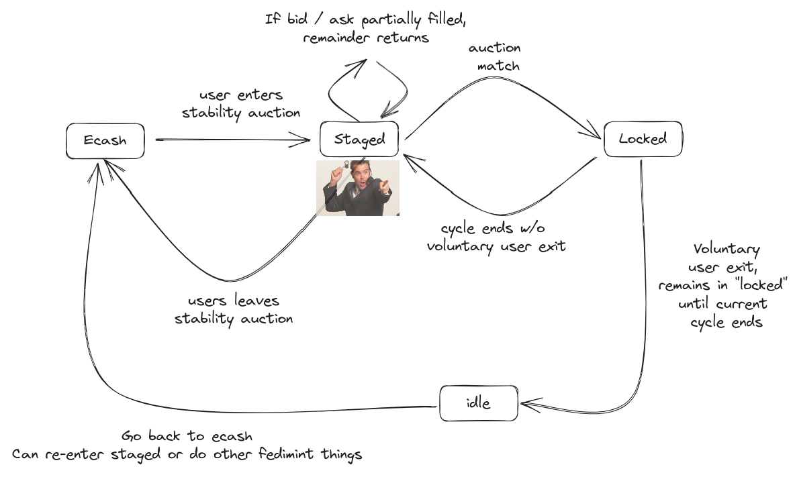
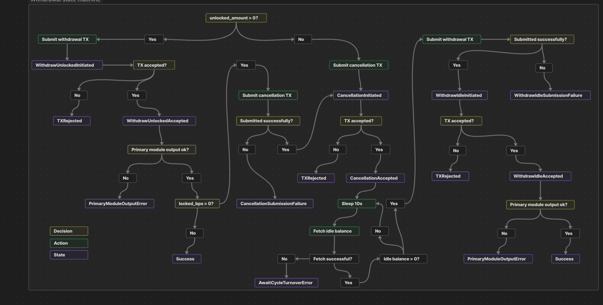

# Fedi Stability Pool

This module adds "stability pool" functionality to Fedi. The stability pool allows users to "lock" in the US dollar value of their ecash for a fee. This feature is targeted towards users who are not willing to tolerate bitcoin's price volatility, but still wish to utilize Fedimint and the wider Bitcoin financial system. Examples could include a shop owner who has fixed costs purchasing stock that is denominated in USD, or an unbanked individual living within a developing nation who desires stability and not Bitcoin exposure.

Users who want a constant dollar value are referred to as stability "seekers", who will be matched with stability "providers".

Under normal working conditions, seekers can expect to maintain the US dollar value of their ecash minus some fee which is paid periodically to providers as a charge for this service.

## Table of contents

- [Functional overview](#functional-overview)
  - [Example scenario](#example-scenario)
  - [Market dynamics](#market-dynamics)
- [Technical overview](#technical-overview)
  - [Module output item](#module-output-item)
  - [Module input item](#module-input-item)
  - [Module consensus item](#module-consensus-item)
  - [Oracle solution](#oracle-solution)
  - [Withdrawal flow](#withdrawal-flow)
  - [Cycle turnover process](#cycle-turnover-process)
  - [Consensus configuration items](#consensus-configuration-items)
- [Miscellaneous](#miscellaneous)
  - [Other currencies and derivatives](#other-currencies-and-derivatives)
  - [Account pool history](#account-pool-history)
  - [Pool fees](#pool-fees)

## Functional overview

The system operates as a periodic auction (also known as a call auction), similar to how most major stock exchanges operate pre-market-open, or how electricity is traded in many parts of the world. The "periodic" element here is a fixed-length cycle of some time duration `t`. The system thus operates in cycles ad infinitum, with all the significant events occurring at cycle turnover.

Seekers and providers submit bids (also knows as seeks) and asks (also known as provides) to the federation using their e-cash balance. Once placed, these seeks and provides are considered as "staged", and must wait for the next cycle turnover. When the turnover occurs, all the staged seeks and provides are processed and a set of contracts called "locks" are produced. At this point, the next cycle's starting BTC price is also recorded as cents.

The cycle turnover is also the moment when the locks that were created at the start of the previous cycle (at time `now - t`) get settled. For this, the change in the price of BTC is used to calculate the payouts for both seekers and providers.

### Example scenario

Let's look at an example scenario involving 1 provider and 1 seeker with the cycle length being 10 minutes. For time, we use the age of the federation. Thus `t = 0` is when the federation started and also when the first cycle started, and `t = 10min` is when the first cycle ended and the second cycle started.

Let's say at time `t = 30min`, when the cycle turnover occurs, the price of BTC is recorded as 12_000_00 cents (12k USD). There were no stability pool participants thus far so there are no locks from the previous cycle to settle, and no staged bids and asks to process for the cycle that just started.

Now let's say that at time `t = 34min` a seeker submits a seek to the federation to stabilize the dollar value of 1_100_100 msats. The clock advances to `t = 40min` and still nothing happens because there are no locks to settle from the cycle that just ended, and no new locks to produce (a seeks needs a provide to produce a lock). The seeker's seek remains in the "staged" state.

At time `t = 45min`, a willing provider submits a provide to the federation for 600_000 msats and a min fee rate of 5000 ppb (parts per billion). Essentially, the provider is saying "I'll happily provide my 600k msats to provide stability to some seeker as long as they can pay me 5000 msats per billion msats stabilized up front for each cycle".

Now when the cycle turnover occurs at time `t = 50min`, let's say the price of BTC is recorded as 12_500_00 cents. We have one staged seek of 1_100_100 msats, and one staged provide of 600_000 msats with min fee rate of 5000 ppb. Depending on the federation's collateral ratio setting, the total provide-side liquidity of 600_000 msats can be used to stabilize some corresponding quantity of seeks. For simplicity, let's say that the collateral ratio is 100%, or 1:1. So 600_000 msats of provide-side liquidity can cover 600_000 msats of seeks.

So to calculate the locks, we take the entire 600_000 msats of provide-side liquidity, as well as 600_003 msats of the staged seek (extra for fees). We pay the provider 4 msats fee up-front (4 instead of 3 due to rounding up—exact mathematical formulas are specified below in the technical explanation). This gives a locked provide of 600_000 msats, a locked seek of 599_999 msats, and a remaining staged seek of `1_100_000 - 600_003` msats. With the new locks (and whatever remains still staged), we start the next cycle.

Naturally, locked funds from the provider cannot be taken out of the system until the end of a cycle to ensure that there is sufficient collateral at all times. Locked funds from the seeker however could theoretically be taken out by triggering an instant settlement. But that increases complexity. So to keep things simple, we prevent altering of locked funds until the end of a cycle.

Finally, let's say that at time `t = 60min`, the nexy cycle turnover occurs and the price of BTC is recorded as 12_000_00. When we go to settle the locks, we'd need to pay the seeker extra msats to preserve the $ value of their msats as it was at the start of the cycle. This happens to be 624_999 msats (exact mathematical formula are specified below in the technical section). So 624_999 msats go to the seeker and whatever is left (`599_999 + 600_000 - 624_999` msats = 575_000 msats) go to the provider.

The amounts auto-renew unless the participants elect to cancel, in which case they exit when the current cycle ends. But if they don't cancel auto-renewal, their seek or provide stays in the system, being locked whenever possible, and being staged otherwise. **In fact, at the start of each cycle, after calculating the payouts and settling the locks for the previous cycle, we first transition all locks back to "staged" and then calculate the new locks for the cycle that just started.** This flow can be represented using the chart below:



### Market dynamics

The stability pool works through hedging, where stability seekers are going short bitcoin and the stability providers are going long to take the other side. In both cases, bitcoin is the collateral they offer to take on these positions. The collateral that seekers put up is always equal to their position but the collateral providers put up is a configurable parameter.

By hedging their bitcoin position, stability seekers will maintain the US dollar value of their locked amount.

Note that providers have inherent leverage in their long positions. If the price of bitcoin goes up, not only does their initial investment go up in value, but they also get more bitcoin from the seekers. On the other hand, if the price of bitcoin goes down, not only does their initial investment go down in value, but they also lose some of their bitcoin to the seekers, as in the above example scenario. This amplification of gains/losses makes providing risky, and we expect providers to be using external trading systems to neutralize this risk and just collect fees from the seekers.

It is possible for the bitcoin price to drop so drastically during a cycle such that the collateral posted by the providers is insufficient to entirely cover the stability seekers' expected payout. The payout from the cycle will be worth less than the expected locked USD value.

The failure point depends on the collateralization ratio of the stability providers, which in our design is a configurable constant for the pool. For example, if the providers provide an equal amount of collateral to seekers, then they are covered for up to a 50% price drop during a single cycle. It is crucial that seekers be made aware of the extent to which they are covered. With short enough cycles (e.g. 10 minute), 1:1 collateralization is likely sufficient. Though users may feel more comfortable when presented with statements like "balance is locked with coverage up to a 90% drawdown", rather than just 50%.

## Technical overview

### Module output item

Depositing funds into the stability pool is technically just a fedimint transaction where the input comes from the e-cash module and the outputs come from the stability pool module and the e-cash module (in case of any change). We define the `StabilityPoolOutput` struct as follows:

```rust
#[derive(Clone, Debug, Hash, PartialEq, Encodable, Decodable)]
pub struct StabilityPoolOutput {
    pub account: XOnlyPublicKey, // used to identify
    pub intended_action: IntendedAction,
}

#[derive(Clone, Debug, Hash, PartialEq, Encodable, Decodable)]
pub enum IntendedAction {
    Seek(Seek),
    Provide(Provide),
    CancelRenewal(CancelRenewal),
    UndoCancelRenewal,
}

#[derive(Clone, Debug, Hash, PartialEq, Eq, Encodable, Decodable, Serialize, Deserialize)]
pub struct Seek(pub Amount);

#[derive(Clone, Debug, Hash, PartialEq, Eq, Encodable, Decodable, Serialize, Deserialize)]
pub struct Provide {
    pub amount: Amount,
    pub min_fee_rate: u64,
}

#[derive(Clone, Debug, Hash, PartialEq, Eq, Encodable, Decodable, Serialize, Deserialize)]
pub struct CancelRenewal {
    pub bps: u32,
}
```

The user's intention behind the deposit must be specified using the `IntendedAction` enum out of the following 4 options:
1. `Seek`: means deposit the specified msat amount for staging a seek. A seek is accepted iff the user does NOT already have staged provides, locked provides, or staged cancellation. Seeks are assigned auto-incrementing sequences by the guardians.
2. `Provide`: means deposit the specified msat amount for staging a provide with the specified min fee rate (in PPB). A provide is accepted iff the user does NOT already have staged seeks, locked seeks, or staged cancellation. Provides are assigned auto-incrementing sequences by the guardians.
3. `CancelRenewal`: means stage a cancellation for the specified % (expressed in basis points) of the user's locked funds. This means that when the current cycle ends, the specified portion of the user's position is not auto-renewed, and is instead moved to their "idle balance" within the stability pool, waiting to be claimed by them later in a transaction. A % unit is used as it works for both seeks and provides (since provider doesn't know either the msats or the $ value that they will receive when the current cycle ends). A cancellation is accepted iff the user does NOT have any staged seeks or provides or staged cancellation AND has at least one locked seek or provide (but not both).
4. `UndoCancelRenewal`: means cancel any staged cancellation because the user changed their mind. Naturally the user must have a staged cancellation.

### Module input item

Withdrawing unlocked funds from the stability pool is technically just a fedimint transaction where the input comes from the stability pool module and the output comes from the e-cash module. We define the `StabilityPoolInput` struct as follows:

```rust
#[derive(Clone, Debug, Hash, PartialEq, Encodable, Decodable)]
pub struct StabilityPoolInput {
    pub account: XOnlyPublicKey,
    pub amount: Amount,
}
```

A user's holdings inside the stability pool are distributed into 3 categories:
1. Idle balance: these are funds that were recovered by canceling auto renewal. They can be freely withdrawn.
2. Staged balance: the sum of any staged seeks or provides that have not been locked yet. They can be freely withdrawn.
3. Locked balance: the sum of any locked seeks or provides. This is not a realized amount, meaning it can fluctuate until the end of the cycle, when the locks are settled and paid out. This amount cannot be withdrawn, and the user must stage a cancellation so that when the cycle ends, a % (could be 100%) of the final payout is moved to idle balance instead of being re-staged and then re-locked.

The `amount` specified in the `StabilityPoolInput` must be less than or equal to the user's total unlocked balance, which is defined as the sum of idle balance and staged balance.

### Module consensus item

The stability pool's contribution to consensus is minimal and contains only the data needed to progress from one cycle to the next. The philosophy here is to only include the bare minimum needed so that everything else can be deterministically calculated by each guardian. With that in mind, the `StabilityPoolConsensusItem` struct is defined as follows:

```rust
#[derive(Clone, Debug, Hash, PartialEq, Encodable, Decodable)]
pub struct StabilityPoolConsensusItem {
    pub next_cycle_index: u64,
    pub time: SystemTime,
    pub price: u64,
}
```

Guardians use the cycle duration (which is part of the consensus configuration) to realize when the next cycle needs to begin. At that moment, they query the oracle (described below) to get the latest BTC/USD price, and propose a new consensus item using their system clock and the index of the next cycle.

When other guardians receive these proposals and consensus items, they wait to see a threshold number of votes before actually processing the cycle turnover (described below). Both the start time and the start price for the turnover are obtained from median values among the votes.

### Oracle solution

To obtain the BTC/USD price, each guardian sends API requests to the following sources in parallel:
1. blockchain.com
2. cex.io
3. coingecko.com
4. coinbase.com
5. bitstamp.net

The median value across all returned values is chosen. The oracle is considered as long as at least one source returns a price. Note that there are two points where a median is selected: among all the price sources, and then among all the guardian votes.

### Withdrawal flow

To make integration with front-ends easier, we use a single `withdraw(unlocked_msats, locked_bps)` function that can extract both unlocked and locked balances, and implicitly wait for cycle turnover for the locked balances to be freed up.

`unlocked_msats` are extracted from staged seeks (pending deposits). `locked_bps` is extracted from locked seeks (completed deposits). The overall operation only completes when both parts have completed. **Note that we can't delay withdrawing staged balance under the hood as it may otherwise become locked. Instead we focus on the overall operation lifecycle as far as UX is concerned.**

#### Case 1: only pending deposits
- Front-end calls `withdraw(unlocked_msats, 0)` with the exact amount of msats that the user wishes to withdraw. User input can be local currency but front-end can translate to msats
- Operation completes as soon as transaction is processed by federation

#### Case 2: only completed deposits
- Front-end calls `withdraw(0, locked_bps)` with a BPS equivalent of what the user wishes to unlock and withdraw. User input can be local currency but front-end can translate to BPS
- Operation lifecycle:
  - cancellation staged (first TX processed by federation)
  - current cycle ends and cancellation applied
  - idle balance swept (second TX processed by federation

#### Case 3: pending deposits + completed deposits
- Front-end calls `withdraw(unlocked_msats, locked_bps)` as per follows:
  - User enters total they would like to withdraw in local currency, say `total_withdrawal_fiat`
  - Front-end converts total pending deposit msat amount into local currency, say `total_staged_fiat`
  - Front-end calculates `min(total_staged_fiat, total_withdrawal_fiat)`, and converts this to msats. This becomes `unlocked_msats`.
  - If `total_withdrawal_fiat` > `total_staged_fiat`, front-end calculates the difference, `total_withdrawal_fiat - total_staged_fiat`, say `rem_withdrawal_fiat`.
  - Front-end uses current fiat value of locked seeks, say `total_locked_fiat`, and determines `rem_withdrawal_fiat * 10_000 / total_locked_fiat`. This is `locked_bps`.
- Operation lifecycle:
  - staged balance withdrawn (first TX processed by federation)
  - cancellation staged (second TX process by federation)
  - current cycle ends and cancellation applied
  - idle balance swept (third TX processed by federation)

The diagram below captures the state machine used for the withdrawal operation. The assumption here is that at least one of `unlocked_msats` and `locked_bps` must be non-zero.



### Cycle turnover process

This is the most interesting part of the business logic. At each cycle turnover, we need to settle the locks, if any, from the cycle that's just ending, as well as calculate the new set of locks for the cycle that's just beginning.

Here's a high-level overview of the full process:

#### Step 1: Logging current cycle as past cycle

We write the current cycle as a past cycle in the guardians' DB. We do this first because in the next steps we will modify the seek and provide locks present within the `Cycle` struct as we settle the current cycle.

#### Step 2: Settling locks using new price

We take the locked seeks and provides (if any) that were produced at the start of the cycle, and "settle" them using the difference in the price of BTC between when the cycle started and now.

For settling the seeks, the quantity we have to preserve is the product of (total msats across all the locked seeks) and (the start price of bitcoin), that is `total_seek_msats * start_price`. Doing ceiling division by `end_price` gives us the new msat amount (`msat_needed_for_seeks`) to keep the product constant. We take the min of `msat_needed_for_seeks` and `total_msats_available` (sum of all the msats across all the locked seeks and provides) to ensure we don't overshoot what we have. This is what's distributed across the seeks to settle them, and whatever is left goes to the provides (could be 0).

#### Step 3: Apply staged cancellations (cancel auto-renewals)

Staged cancellations from providers and seekers, if any, would have been received earlier, awaiting the cycle turnover to free up funds. We iterate through all the staged cancellations, and delete settled locks (partially or wholly depending on the basis points specified as part of the staged cancellation). Note that the scope of a cancellation is an account—not a specific seek or provide. So if an account has 3 locked seeks and they wish to cancel 50% (5_000 BPS) of their locked seeks, we cancel 50% of the total msats across all 3 seeks from being locked again in the next cycle. When cancelling we go in reverse order of sequence to preserve more of the older seeks/provides (which would have higher priority in the matching algorithm).

#### Step 4: Restage remaining locks

Once locks have been settled and cancellations have been applied, we move any remaining locks back to the staged state. This is a convenience step that streamlines the rest of the algorithm by constraining the inputs of the matching algorithm to a single source: staged locks and provides. The `LockedSeek` and `LockedProvide` structs already have the original staged sequences, so we are able to transform them into staged items with the same sequences, thereby guaranteeing the same priority as before.

In case a lock was made by consuming a staged item only partially, the staged item would still remain (unless withdrawn by user at some point during the cycle) with the leftover amount. We detect those duplicates in this step and merge them as well.

#### Step 5: Calculate new locks

To begin the matching process, we first read from the DB (and remove after reading) all the staged seeks and staged provides **in sorted order**. Seeks are sorted by the sequence (a server-assigned nonce-like attribute) to prioritize older seeks, and provides are sorted first by the min fee rate, and then by sequence. Then using the sorted staged seeks and provides, as well as the seek-to-provide collateral ratio setting of the federation, we calculate the locked provides and effective fee rate.

To calculate the locked provides and effective fee rate, we start with sum of all the seeks, and determine *how much provider collateral is needed to cover this sum of seeks* using the mathematical formula specified below:

```
R: remaining provider collateral needed
S_s: sum of all seeks
f: current effective fee rate (starts at 0 when P below is 0)
B: ppb unit (1_000_000_000)
C_p: provider side of collateral ratio
C_s: seeker side of collateral ratio
P: provider collateral already included (starts at 0)

Given the above symbols, we have the following equation:
R = [     S_s      * [  1 - (f/B) ] *       C_p/C_s     ] - P
     (total seeks)   (take out fee)   (collateral ratio)

This can further written as:
R = [(S_s * (B - f) * C_p) / (B * C_s)] - P

And finally as:
R = [(S_s * (B - f) * C_p) - (P * B * C_s)] / (B * C_s)
```

The point of transforming the equation is to ensure that division is the last operation, which allows us to retain the most precision. We guarantee that our precision loss would be smaller than 1 millisat, and since we will use ceiling division in the end, we will always overcollateralize as opposed to falling short.

Also note that the numerator is produced by subtracting two terms. If the left term happens to be less than the right term, our final result would be negative. In that case we just return 0, which should signify that we shouldn't include any more provider collateral.

So to determine the locked provides, we keep traversing through the list of sorted provides, including them one-by-one until `R` in the formula above becomes 0 (we calculate `R` at each step), or until we run out of provides. If a staged provide gets fully used, then it gets deleted from the list of staged provides. Otherwise, if it gets only partially used, the leftover amount is still left in the list of staged provides.

Once we have computed the list of locked provides, effective fee rate, and the total amount across all the provides, we can then calculate the list of locked seeks. This time, we determine *what is the sum of seeks BEFORE FEE IS TAKEN that can be satisfied by the given sum of provides* using the mathematical formula specified below:

```
S: Included seeks sum before fees (starts at 0)
f: current effective fee rate
B: ppb unit (1_000_000_000)
C_p: provider side of collateral ratio
C_s: seeker side of collateral ratio
P: provider collateral already included

Given the above symbols, we have the following equation:
S * [  1 - (f/B) ] = P * (         C_s/C_p        )
    (take out fee)       (inverse collateral ratio)

This can further written as:
[S * (B - f)] / B = (P * C_s) / C_p

Solving for S:
S = (P * C_s * B) / [(B - f) * C_p]
```

The point of transforming the equation is to ensure that division is the last operation, which allows us to retain the most precision. We guarantee that our precision loss would be smaller than 1 millisat, and since we will use floor division in the end, we will always overcollateralize as opposed to falling short.

Once we've calculated `S` above, we keep traversing the staged seeks and including them one-by-one until we exhaust `S`. If a staged seek gets fully used, then it gets deleted from the list of staged seeks. Otherwise, if it gets only partially used, the leftover amount is still left in the list of staged seeks.

Note that because our calculation for `S` didn't yet deduct fee, we now have to do that from each locked seek. So we debit the fee amount (using ceiling division) from each locked seek proportional to its share of the total seek pool, and credit it to each provider up-front as part of the provider's idle balance.

Finally, whatever staged seeks and provides are still left are written back to the DB.

#### Step 6: Write new current cycle

With the new list of locked seeks and providers as well as the new price and start time, we write the new cycle as the current cycle in the DB.

### Consensus configuration items

Some of the items below are already part of the consensus configuration. Some will be moved there shortly.

- Oracle config: whether to use a mock oracle (in tests) or a live aggregate oracle (described above)
- Consensus threshold: minimum number of guardian votes needed to reach consensus
- Minimum seek/provide deposit amounts and cancellation amounts: to prevent griefing or DoS-style attacks
- Max provider fee rate: to prevent price gouging by providers when demand for their service is high
- Fee for each operation: currenty all set to 0, but could be easily set

## Miscellaneous

### Other Currencies and Derivatives

Note that the oracle can be changed to one's liking, the most obvious use case being the ability to denominate stability in other BTC currency pairs. For example by changing to BTCXXX, instead of locking in USD value, the stability pool could lock in Argentine Peso value or South African Rand. We believe this module is extremely promising internationally, and in fighting the mission of banking the unbanked.

Furthermore, one can begin to make bitcoin collateralized derivatives on any exotic product, so long as an appropriate price feed can be found or created. With this module one could make it possible for Fedimint users to trade anything, even SOYBEAN/BTC.

### Account pool history

In order to understand their current state clients are limited to viewing:

- Their position in the current cycle (locked and unlocked balance).
- Their staged action for the next cycle

In order to provide an account history feature so the user can better understand how they got to their current balance they will have to check their position during every cycle.

It is possible that this information may be stored by the server for them so they can retrieve it even when they are offline for a whole cycle, however storing this forever could be a privacy issue.

### Pool fees

In market conditions where leveraged long positions are highly desired the provider fee falls to 0.
It may be advantageous to allow this to go negative so that providers pay seekers.
Note it is not necessary that the seekers receive the funds from the negative feerate directly.
They could instead go into a bailout fund to buffer against large falls or be used to smooth out the feerate when the feerate goes higher again.
