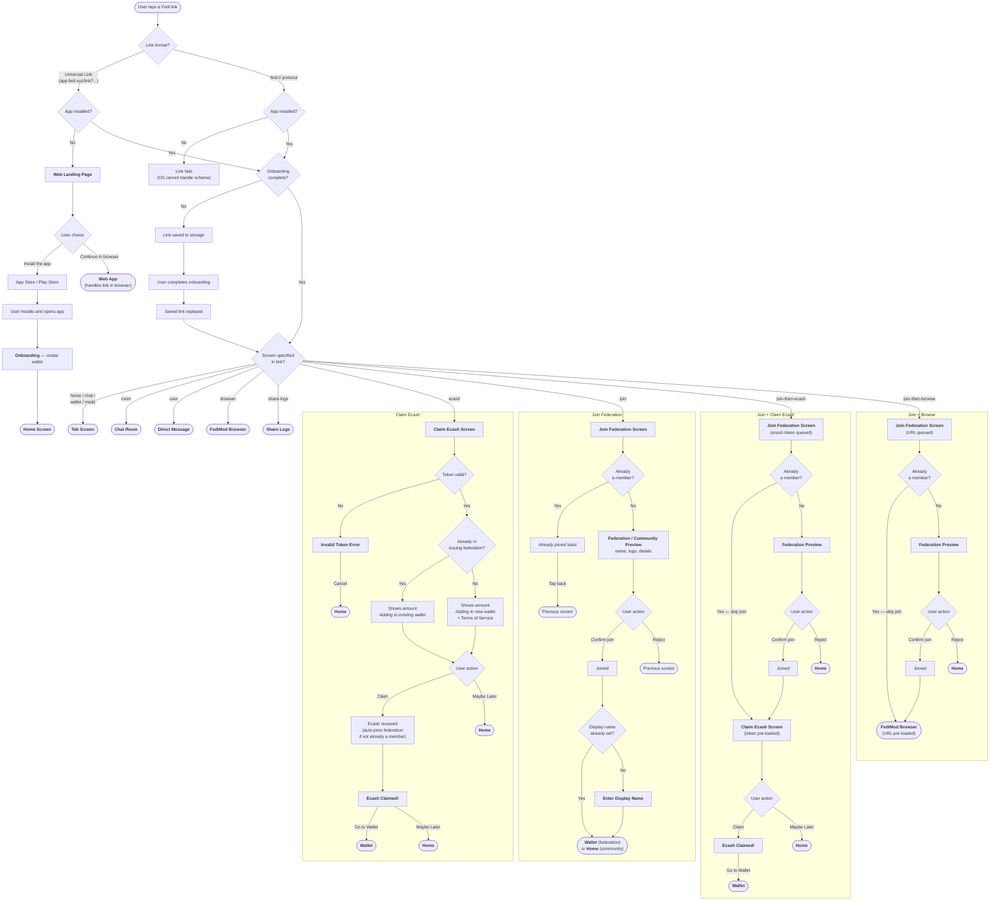

# Deep Linking

## Overview

The deep linking system handles navigation from external URLs into specific screens within the app. It supports two link formats:

-   **Deep links** — Universal Links hosted on our domain, e.g. `https://app.fedi.xyz/link?screen=chat&roomId=123`. When a user taps a deep link without the native app installed, they are taken to the web's deep link landing page where they can choose to continue in the browser or install the native app. Once the native app is installed, tapping a deep link will open the app directly.
-   **Internal links** — Native protocol links prefixed with `fedi://`, e.g. `fedi://room?roomId=123`. These are what deep links get converted into before being processed, and are also used directly within the app.

Onboarding must be completed first for deeplinks to trigger actions and behave as expected. If onboarding is not complete, deeplink actions are saved to Redux via `setRedirectTo` and handled later.

---

## User Flow Diagram

The diagram below traces every path a user can take when tapping a Fedi deep link — from initial tap through app resolution, routing, and final destination.



---

## How It Works

### Link Processing

All deep links pass through the same pipeline regardless of how they arrive (tap, cold start, notification, or in-app call):

```
Incoming URL
     │
     ├─ isDeepLink()?  →  Yes → normalizeDeepLink()  →  fedi://screen?params
     │                     No  → pass through as-is
     ▼
getLinking().subscribe()
     │
     ├─ Onboarding incomplete?  →  save to Redux, replay after onboarding
     ▼
getInternalLinkRoute()  →  look up screen in screenMap  →  NavigationState
```

**How links arrive:**

-   **Cold start** — `Linking.getInitialURL()` and `notifee.getInitialNotification()` capture the URL on launch. If the navigator isn't mounted yet, the link is queued in `pendingLinks` and flushed in `onReady`.
-   **Foreground** — `Linking.addEventListener` fires with the URL.
-   **Notification** — Notifee's `onForegroundEvent` extracts the `link` field from the notification data payload.
-   **In-app** — `patchLinkingOpenURL` (called once at module load) intercepts all `Linking.openURL` calls so deep links route internally instead of opening a browser.

### Deep Link → Internal Link Conversion

`normalizeDeepLink()` converts a universal link to the internal format. The `screen` parameter becomes the path and all other parameters are preserved:

```
https://app.fedi.xyz/link?screen=room&roomId=abc123  →  fedi://room?roomId=abc123
```

Both `?` and `#` delimiters are supported (e.g. `link#screen=room&roomId=abc123`).

---

## Key Files

| File | Role |
| ---- | ---- |
| `Router.tsx` | Wires `getLinking` into `NavigationContainer`, flushes pending links on ready, patches `Linking.openURL` |
| `utils/linking.ts` (native) | `getLinking`, `getInternalLinkRoute`, `screenMap`, `navigateToUri`, `flushPendingLinks`, `patchLinkingOpenURL` |
| `common/utils/linking.ts` | `isDeepLink`, `normalizeDeepLink`, `isFediDeeplinkType`, `stripFediPrefix`, `normalizeCommunityInviteCode` |

---

## Supported Routes

The canonical list of supported screens lives in the `screenMap` object in [`utils/linking.ts`](../native/utils/linking.ts). Each key is a screen name (e.g. `"room"`, `"join-then-ecash"`) and its function returns the navigation target and any parameter mappings.

Deep links follow this format:

```
https://app.fedi.xyz/link#screen=<screen>&param1=value1&param2=value2
```

Both `?` and `#` delimiters are supported. Community invite codes with a `fedi:` prefix are normalised automatically.

---

## Notes

-   Links that arrive before onboarding is complete are saved to Redux (`setRedirectTo`) and replayed after onboarding finishes.
-   Links that arrive before the navigator is ready are queued and flushed once `onReady` fires.
