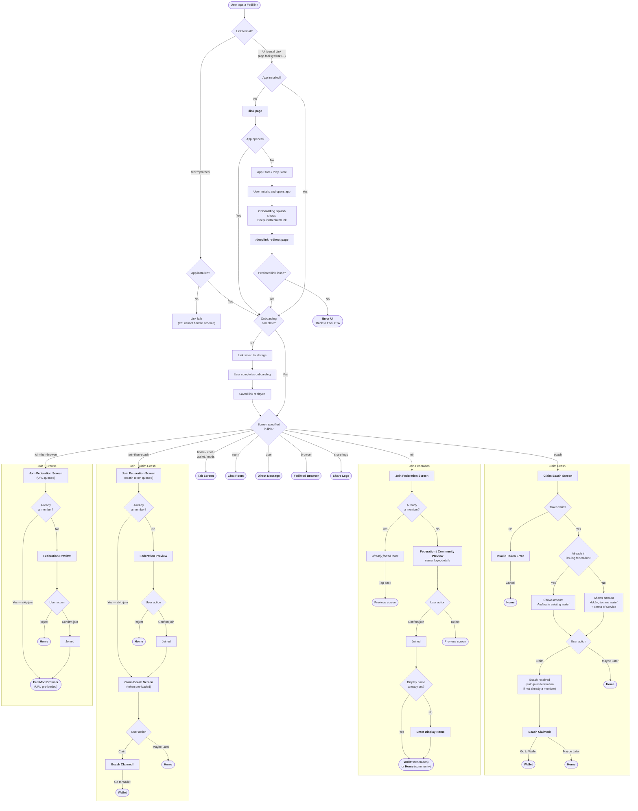

# Deep Linking

## Overview

The deep linking system routes external URLs to specific screens in the native app. Two link formats:

-   **Universal Links** — `https://app.fedi.xyz/link?screen=...`. Users tap these; the web handles them at [`/link`](../web/src/pages/link.tsx).
-   **Internal links** — `fedi://screen?...`. The native app routes on these directly. Universal links are normalized to this form via [`normalizeDeepLink`](../common/utils/linking.ts).

Onboarding must complete before a deeplink routes. Pending links are stashed in Redux (`redirectTo` in [`environment.ts`](../common/redux/environment.ts)) and replayed by [`Splash.tsx`](../native/screens/Splash.tsx). The universal-link host allowlist lives in [`DEEPLINK_HOSTS`](../common/constants/linking.ts).

---

## User Flow Diagram

The diagram below traces every path a user can take when tapping a Fedi deep link — from initial tap through app resolution, routing, and final destination.



---

## How It Works

### Link Processing

All links go through the same pipeline regardless of entry point:

```
Incoming URL
     │
     ├─ isDeepLink()?  →  Yes → normalizeDeepLink()  →  fedi://screen?params
     │                     No  → pass through as-is
     ▼
getLinking().subscribe()
     │
     ├─ Onboarding incomplete?  →  stash in Redux, replay after onboarding
     ▼
getInternalLinkRoute()  →  look up screen in screenMap  →  NavigationState
```

The native pipeline (subscribe, route, `screenMap`, `patchLinkingOpenURL`) lives in [`utils/linking.ts`](../native/utils/linking.ts). Parsing helpers (`isDeepLink`, `normalizeDeepLink`, `stripFediPrefix`, `normalizeCommunityInviteCode`) are in [`common/utils/linking.ts`](../common/utils/linking.ts).

**Entry points** — all wired in [`Router.tsx`](../native/Router.tsx):

-   **Cold start** — `Linking.getInitialURL` and `notifee.getInitialNotification`. Links arriving before nav mounts are queued in `pendingLinks` and flushed on `onReady`.
-   **Foreground** — `Linking.addEventListener`.
-   **Notification** — Notifee's `onForegroundEvent` pulls the `link` field from the notification data payload.
-   **In-app** — `patchLinkingOpenURL` intercepts `Linking.openURL` so deep links route internally instead of opening a browser.

### Deep Link → Internal Link Conversion

[`normalizeDeepLink`](../common/utils/linking.ts) converts a universal link to the internal format. The `screen` param becomes the path; everything else passes through:

```
https://app.fedi.xyz/link?screen=room&roomId=abc123  →  fedi://room?roomId=abc123
```

Both `?` and `#` delimiters are supported.

### Post-install Fallback (Web)

When a tapped universal link finds no installed app, the web preserves it across the install detour:

-   [`/link`](../web/src/pages/link.tsx) writes the URL to `localStorage` via [`setPendingDeeplink`](../web/src/utils/localstorage.ts) and attempts the `fedi://` scheme.
-   After install, [`/deeplink-redirect`](../web/src/pages/deeplink-redirect.tsx) reads and clears the entry, then re-fires the scheme.
-   The native [`DeepLinkRedirectLink`](../native/components/ui/DeepLinkRedirectLink.tsx) — shown on the onboarding splash when the user has no joined federations or non-global communities — opens the system browser to [`getDeeplinkResumeUrl`](../common/constants/api.ts), bridging the user back to `/deeplink-redirect`.

Layout primitives shared by both web pages live in [`DeeplinkPageLayout.tsx`](../web/src/components/DeeplinkPageLayout.tsx).

---

## Supported Routes

Routes are defined in `screenMap` in [`utils/linking.ts`](../native/utils/linking.ts). Each key is a screen name (e.g. `"room"`, `"join-then-ecash"`) mapping to a navigation target and parameter mapping.

Universal links use `?` or `#` delimiters. Community invite codes with a `fedi:` prefix are normalised automatically via [`normalizeCommunityInviteCode`](../common/utils/linking.ts).

---

## Notes

-   Links arriving before onboarding completes are stashed via `setRedirectTo` ([`environment.ts`](../common/redux/environment.ts)) and replayed in [`Splash.tsx`](../native/screens/Splash.tsx).
-   Links arriving before nav mounts are queued in [`Router.tsx`](../native/Router.tsx)'s `pendingLinks` and flushed on `onReady`.
