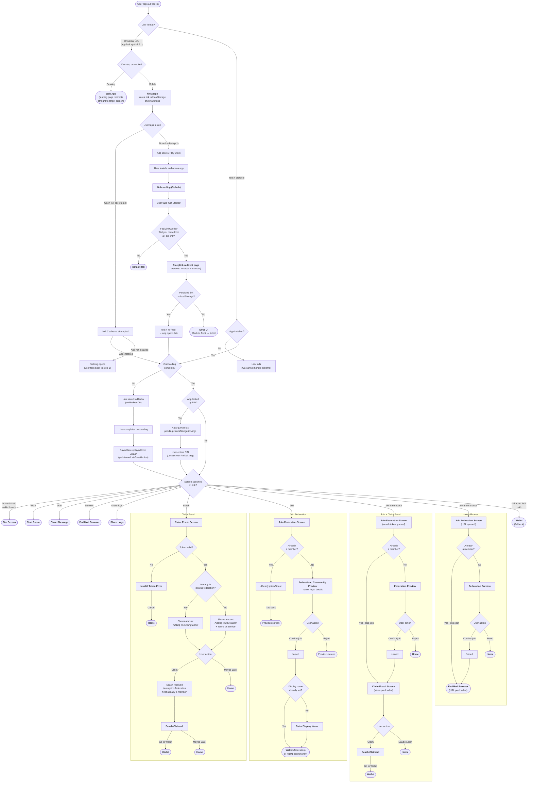

# Deep Linking

## Overview

The deep linking system handles navigation from external URLs into specific screens within the app. It supports two link formats:

-   **Deep links** - Universal Links hosted on our domain, e.g. `https://app.fedi.xyz/link?screen=chat&roomId=123`. When a user taps a deep link on a device where the OS does not open the native app directly (e.g. app not installed, or Android App Links auto-verification failed), they land on the web's deep link landing page at [`/link`](../web/src/pages/link.tsx). On desktop the landing page redirects straight to the corresponding screen in the web app; on mobile it shows a 2-step flow that guides the user through installing the app and opening the link in it.
-   **Internal links** - Native protocol links prefixed with `fedi://`, e.g. `fedi://room?roomId=123` (query form) or `fedi://room/123` (path form). These are what deep links get converted into before being processed, and are also used directly within the app. Both query and path forms are supported; path form is what notification payloads typically use.

Both onboarding and the PIN lock must be cleared before any linking action can fire. The same gate applies to non-Fedi payment URIs (`lightning:`, `bitcoin:`, `lnurl:`, …) so URL contents are never parsed pre-auth and the omni overlay never surfaces over the lock screen. Depending on the URL type, the gate stashes:

-   **Fedi navigation links** - if onboarding is incomplete, the original link is saved to Redux via `setRedirectTo` and replayed from the Splash screen after onboarding. If the app is locked, the parsed navigation args are queued as `pendingUnlockNavigationArgs` and replayed after a successful PIN unlock.
-   **Payment URIs** - if the app is locked, the raw URL is queued as `pendingUnlockExternalUrl` and replayed through the omni parser (via `Router.tsx`) once the unlock gate clears.

---

## User Flow Diagram

The diagram below traces every path a user can take when tapping a Fedi deep link - from initial tap through app resolution, routing, and final destination.



The mobile landing page has **two** ways to land the user back in the native app, because the link is captured at different layers depending on whether the app was already installed:

-   **Open in Fedi (app already installed)** - the `fedi://` scheme fires, the OS hands the link to the native app, and it flows through the onboarding / PIN gates like any internal link. If onboarding is incomplete the link is stashed via `setRedirectTo` and replayed automatically from Splash.
-   **Download → install → onboard (fresh install)** - the native app never saw the link, so there is no `setRedirectTo` value. Instead, the `/link` page stored the link in the mobile browser's `localStorage`. After onboarding, the `FediLinkOverlay` asks "Did you come from a Fedi link?"; tapping **Yes** opens `/deeplink-redirect` in the system browser, which reads the stored link and re-fires the `fedi://` scheme into the now-installed app.

---

## How It Works

### Web Landing Page

The landing page lives at `/link` in the web app (`ui/web/src/pages/link.tsx`) and behaves differently per platform:

-   **Desktop** - immediately redirects to the target screen in the web app via `getDeepLinkPath(url)`.
-   **Mobile** - stores the link in `localStorage` via `setPendingDeeplink` (so it survives an install detour), then renders a 2-step layout (`DeeplinkHeroLayout`):
    1. **Download the Fedi App** - opens the App Store or Play Store based on user agent.
    2. **Open in app** - attempts the `fedi://` custom scheme, which opens the app if it is installed.

The mobile page does **not** auto-attempt the scheme on load, and there is no "continue in browser" path - its only goal is to get the user into the native app.

### Post-install Resume (Web)

The link stored in `localStorage` is replayed after a fresh install via `/deeplink-redirect` (`ui/web/src/pages/deeplink-redirect.tsx`):

-   During onboarding, `Splash` shows the `FediLinkOverlay` ("Did you come from a Fedi link?") whenever there is no natively-captured `redirectTo`. Tapping **Yes** (`handleFediLink`) completes onboarding and opens `${API_ORIGIN}${DEEPLINK_RESUME_PATH}` (`/deeplink-redirect`) in the system browser.
-   `/deeplink-redirect` reads and clears the stored link via `getPendingDeeplink` / `clearPendingDeeplink`, then re-fires the `fedi://` scheme into the installed app. If no valid link is found it falls back to a `fedi://` "Back to Fedi" CTA.

Layout primitives shared by both web pages live in [`DeeplinkPageLayout.tsx`](../web/src/components/DeeplinkPageLayout.tsx).

### Link Processing

All deep links pass through the same pipeline regardless of how they arrive (tap, cold start, notification, or in-app call):

```
Incoming URL
     │
     ├─ getNavigationLink()?  →  Universal link → fedi://screen?params
     │                           fedi: link     → pass through
     │                           payment URI    → undefined (handled as external)
     ▼
getNavigationLinkReadiness()
     │
     ├─ Fedi link + onboarding incomplete?  →  save to Redux (setRedirectTo)
     │                                         → { kind: 'handled' }, replay from Splash
     ├─ Fedi link + app locked?             →  queue pendingUnlockNavigationArgs
     │                                         → { kind: 'handled' }, replay after PIN
     ├─ Payment URI + app locked?           →  queue pendingUnlockExternalUrl
     │                                         → { kind: 'handled' }, replay via omni parser
     ├─ Fedi link + ready?                  →  { kind: 'ready', navigationLink }
     └─ Payment URI + ready?                →  { kind: 'external', url }
     ▼
ready      →  getInternalLinkTarget()  →  canonical { kind: 'tab' | 'root', screen, params }
                │
                ├─ getInternalLinkRoute()          →  React Navigation state (for getStateFromPath)
                ├─ getInternalLinkNavigationArgs() →  imperative nav args  (for Initializing/LockScreen)
                └─ getInternalLinkResetAction()    →  reset action         (for Splash replay + patched openURL)

external   →  fallback(url)  →  omni parser (OmniLinkHandler)
handled    →  swallowed; replayed later from the appropriate gate
```

Root-stack destinations always reset with `Wallet` underneath so back-button navigation has a valid fallback history entry. Unknown `fedi:` paths fall back to Wallet instead of failing.

**How links arrive:**

-   **Cold start** - `Linking.getInitialURL()` and `notifee.getInitialNotification()` capture the URL on launch. Fedi links become React Navigation's initial state; payment URIs are routed straight to the omni parser via the `fallback` option (returning them raw would leave React Navigation with a non-navigable scheme it silently drops).
-   **Foreground** - `Linking.addEventListener` fires with the URL.
-   **Notification** - Notifee's `onForegroundEvent` extracts the `link` field from the notification data payload.
-   **In-app** - `patchLinkingOpenURL` (called once at module load) intercepts all `Linking.openURL` calls so both universal links and raw `fedi:` links route internally via the same reset action instead of opening a browser. Links that arrive before the navigator is ready are queued in `pendingLinks` and flushed in `onReady`.

### Deep Link → Internal Link Conversion

`getNavigationLink()` is the single entry point used by every arrival path. It accepts either a universal link or a raw `fedi:` link and returns the normalized internal URL:

```
https://app.fedi.xyz/link?screen=room&roomId=abc123  →  fedi://room?roomId=abc123
fedi://room?roomId=abc123                            →  fedi://room?roomId=abc123  (unchanged)
fedi://room/abc123                                   →  fedi://room/abc123         (path form, unchanged)
https://other.example/anything                       →  undefined
```

Internally it delegates to `normalizeDeepLink()` for universal links and `isFediInternalLink()` for raw `fedi:` links. Both `?` and `#` delimiters are supported on universal links (e.g. `link#screen=room&roomId=abc123`).

### Path-based vs Query-based Internal Links

Internal links support both `fedi://<screen>?param=value` and `fedi://<screen>/<value>` forms for root-stack screens. The path form is what notification payloads use. Resolution order inside `getInternalLinkTarget`:

1. **`getBrowserPathTarget`** - if the path starts with `browser/`, everything after is treated as the URL payload (so `fedi://browser/https://stacker.news` is preserved verbatim).
2. **`screenMap` lookup** on the leading segment (e.g. `room`, `join`) - handles the query form and any screens that need custom param mapping (like `join-then-ecash`).
3. **`getConfigPathTarget`** - matches against `rootScreenPaths` (`room/:roomId`, `user/:userId`, `share-logs/:ticketNumber`, `ecash/:id`, `join/:invite`, `browser/:url`). Path params are percent-decoded; values containing further `/` segments are rejected.
4. **Unknown-but-known-schema fallback** - any unrecognized `fedi:` path falls back to the Wallet tab rather than failing.

---

## Key Files

| File                                                | Role                                                                                                                                                                                                                                                                 |
| --------------------------------------------------- | -------------------------------------------------------------------------------------------------------------------------------------------------------------------------------------------------------------------------------------------------------------------- |
| `Router.tsx`                                        | Wires `getLinking` into `NavigationContainer`, flushes pending links on ready, patches `Linking.openURL`, and replays `pendingUnlockExternalUrl` through the omni parser after PIN unlock                                                                            |
| `utils/linking.ts` (native)                         | `getLinking`, `getInternalLinkRoute`, `getInternalLinkResetAction`, `getInternalLinkNavigationArgs`, `navigationArgsToResetAction`, `consumePendingUnlockNavigationArgs`, `consumePendingUnlockExternalUrl`, `screenMap`, `flushPendingLinks`, `patchLinkingOpenURL` |
| `screens/Splash.tsx`                                | Replays `redirectTo` after onboarding via `getInternalLinkResetAction`; otherwise shows `FediLinkOverlay` to bridge fresh installs to `/deeplink-redirect`                                                                                                          |
| `components/feature/onboarding/FediLinkOverlay.tsx` | Onboarding prompt ("Did you come from a Fedi link?"); **Yes** opens `/deeplink-redirect` in the system browser to resume a link captured only in web `localStorage`                                                                                                  |
| `screens/LockScreen.tsx`                            | Replays `pendingUnlockNavigationArgs` after PIN unlock via `navigationArgsToResetAction`                                                                                                                                                                             |
| `screens/Initializing.tsx`                          | Consumes `pendingUnlockNavigationArgs` on cold start to route already-unlocked deeplinks into the correct stack                                                                                                                                                      |
| `common/utils/linking.ts`                           | `getNavigationLink`, `isDeepLink`, `normalizeDeepLink`, `isFediInternalLink`, `isFediDeeplinkType`, `normalizeBrowserUrl`, `stripFediPrefix`, `normalizeCommunityInviteCode`, plus the `DEEP_LINK_SCREENS` / `DEEP_LINKS` drift-prevention schema                    |
| `web/src/pages/link.tsx`                            | Mobile 2-step landing page (stores link, Download + Open); desktop redirect via `getDeepLinkPath`                                                                                                                                                                    |
| `web/src/pages/deeplink-redirect.tsx`               | Post-install resume page: reads the stored link from `localStorage` and re-fires the `fedi://` scheme                                                                                                                                                               |

---

## Supported Routes

The canonical list of supported screens lives in the `screenMap` object in [`utils/linking.ts`](../native/utils/linking.ts). Each key is a screen name (e.g. `"room"`, `"join-then-ecash"`) and its function returns an `InternalLinkTarget` describing the navigation target and any parameter mappings. That target is then translated into React Navigation state, imperative nav args, or a reset action depending on which helper calls it. The shared `DEEP_LINK_SCREENS` list in [`common/utils/linking.ts`](../common/utils/linking.ts) is the source of truth for valid screen names: `screenMap` is type-constrained to cover every `DeepLinkableScreen`, and a unit test asserts every screen in `DEEP_LINKS` has a `screenMap` handler.

Deep links follow this format:

```
https://app.fedi.xyz/link#screen=<screen>&param1=value1&param2=value2
```

Both `?` and `#` delimiters are supported. Internal links accept either query form (`fedi://<screen>?param=value`) or path form (`fedi://<screen>/<value>`) for root-stack screens whose pattern is declared in `rootScreenPaths` (`room`, `user`, `share-logs`, `ecash`, `join`, `browser`). Community invite codes with a `fedi:` prefix are normalised automatically. Bare browser URLs get `https://` prepended to match the in-app address bar. Unknown `fedi:` paths fall back to the Wallet tab rather than failing.

---

## Notes

-   Links that arrive before onboarding is complete are saved to Redux (`setRedirectTo`) and replayed from `Splash` after onboarding finishes.
-   Links the native app never sees (fresh installs that only stored the link in the mobile browser's `localStorage`) are resumed via the `FediLinkOverlay` → `/deeplink-redirect` path instead.
-   Fedi links that arrive while the app is locked are stored as `pendingUnlockNavigationArgs` and replayed after the user enters their PIN (from either `LockScreen` or `Initializing`).
-   Payment URIs (`lightning:`, `bitcoin:`, `lnurl:`, …) that arrive while the app is locked are stored as `pendingUnlockExternalUrl` and handed to the omni parser from `Router.tsx` once `isAppUnlocked` flips true.
-   Links that arrive before the navigator is ready are queued in `pendingLinks` and flushed once `onReady` fires.
-   Root-stack deeplink destinations are reset with `Wallet` underneath so screens with a back button always have somewhere to return to.
